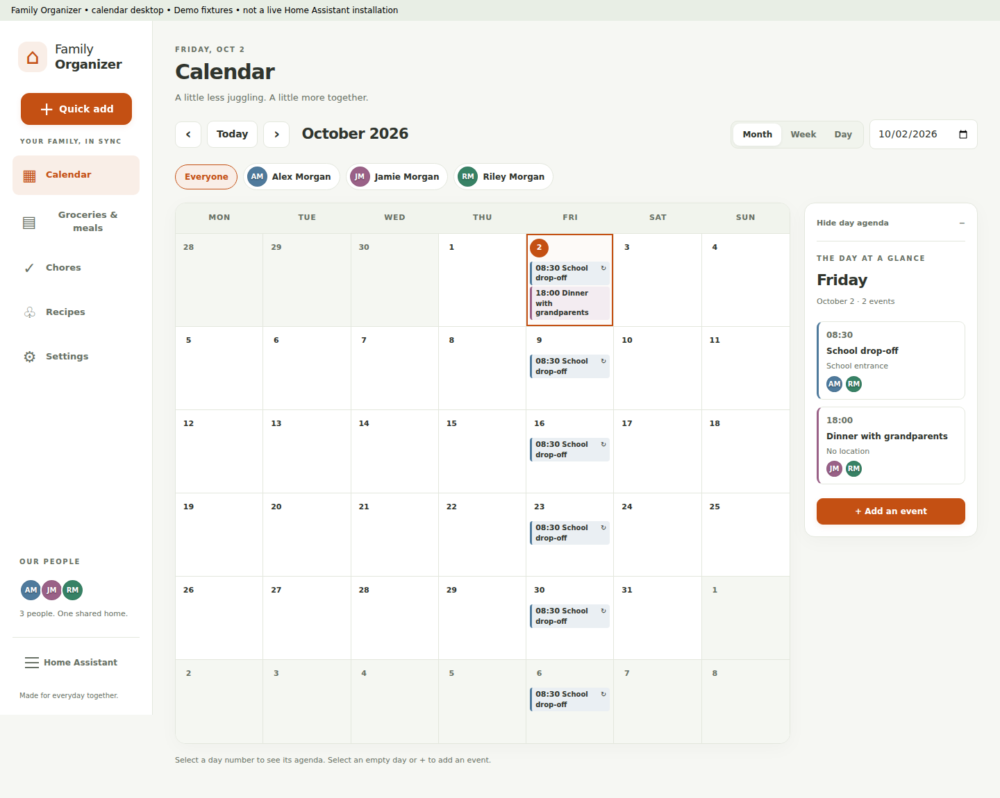
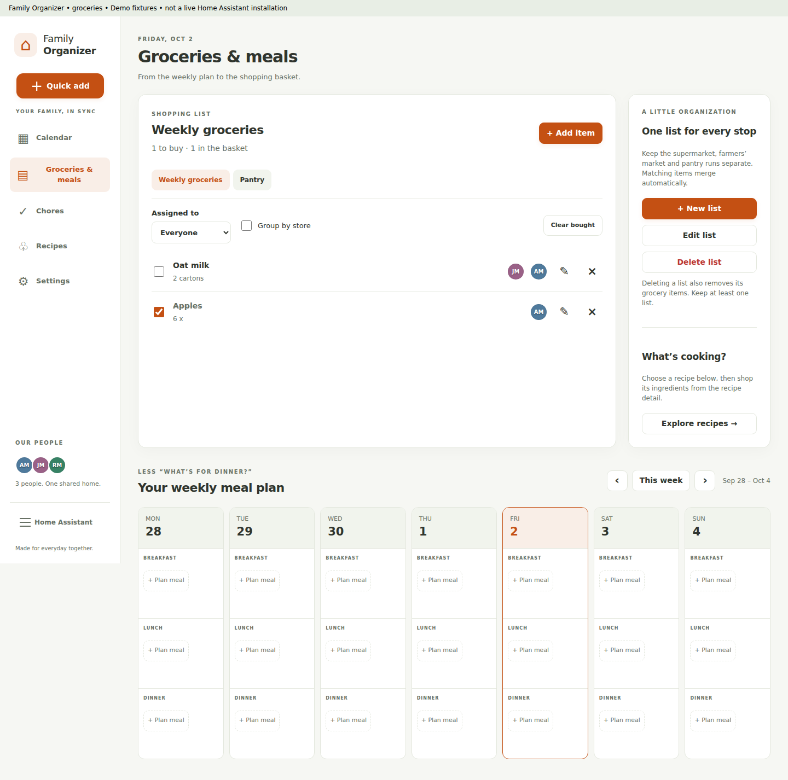
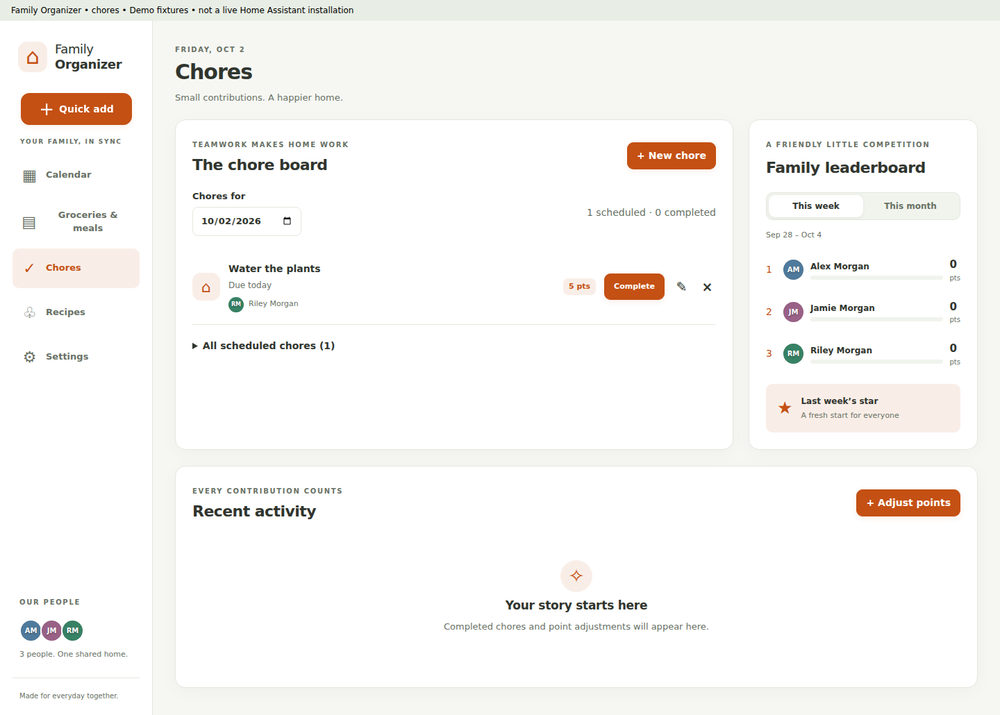
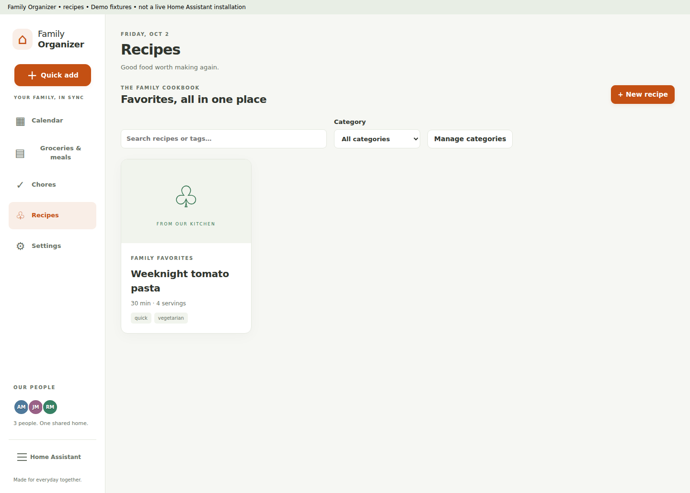
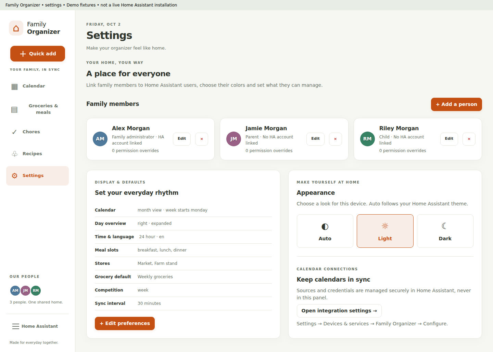

# Family Organizer

A local-first Home Assistant integration and touch-friendly family dashboard.
It provides ten pages modeled on a Cozi-style family organizer: Today, Calendar,
Shopping, To Do, Meals, Chores, Journal, Contacts, Birthdays, and Settings.

## Highlights

- Today dashboard: agenda, upcoming events, meals, shopping, to-dos, chores,
  latest journal moment and upcoming birthday callouts in one view
- Month/week/day calendar, RFC 5545 recurrence, and timezone-aware ICS/CalDAV sync
- Event reminders with per-event lead times, delivered through any `notify`
  service (companion app) or persistent notifications, plus an optional daily
  agenda digest and a `family_organizer_reminder` event for automations
- Calendar export as `.ics` from the toolbar or the authenticated
  `/api/family_organizer/calendar.ics` subscription endpoint
- Shared family contacts with groups, tap-to-call numbers, mail links and notes
- Recipe import from any web page that publishes schema.org recipe data
- Multiple shopping lists with store and assignee routing, merging, and todo entities
- Separate To Do lists (packing, projects, errands) with due dates and assignees,
  also exposed as Home Assistant todo entities
- Breakfast/lunch/dinner planning across a horizontally swipeable seven-day view
- Recipe serving scaling and selectable ingredients routed to any shopping list
- Scheduled chores and week/month competitions with per-person avatars
- Family journal with dated entries, tagged family members and photo URLs
- Birthday countdowns computed from each person's birthday
- Home Assistant users mapped to `parent_admin`, `parent`, or `child`
- Per-person capability overrides plus creator/assignee ownership checks
- Live websocket updates after UI, service, todo-entity, and calendar-sync changes
- Home Assistant theme following or a persistent local light/dark preference
- Cozi-inspired navigation, warm quick-add controls and family-color calendars,
  with original code and Family Organizer identity (not affiliated with Cozi)

## Screens



[Mobile calendar](docs/screenshots/fixture-calendar-mobile.png)

| Groceries & seven-day meals | Chores & points |
| --- | --- |
|  |  |

| Recipe box | Settings & permissions |
| --- | --- |
|  |  |

Screenshots are labeled demonstration fixtures, not a live Home Assistant
installation or real family data.

The responsive panel uses the Home Assistant theme and card variables. Desktop
views show dense calendars and leaderboards; narrow screens turn navigation,
calendar days, and meal slots into native horizontal scroll/swipe tracks.
Create and edit forms open in keyboard-accessible dialogs. Date selection opens
the day agenda; the date's add control creates an event for that day. Event
details provide edit and duplicate actions when your permissions allow them.

Design references: Cozi's public [new web quick start](https://www.cozi.com/getting-started-with-new-cozi-web/),
[calendar guide](https://www.cozi.com/calendar/),
[web guide](https://www.cozi.com/getting-started-with-cozi-on-the-web/) and
[media kit](https://www.cozi.com/press-media-kit/). The navigation, orange add
control, readable event times and family colors are inspired by those guides;
proprietary artwork and service integrations are not included.
The official guide's sidebar, orange quick-add, event times, family colors and
event detail/duplicate flow informed this implementation. Direct reference-page
and image access failed in the implementation sandbox, so this is not a
pixel-perfect screenshot comparison or a reproduction of Cozi's assets.

| Today | Calendar | Shopping and Meals | Chores |
| --- | --- | --- | --- |
| Family overview for the current day | Month/week/day switcher, recurrence, day details | List/store routing, weekly planner and three daily meal slots | Scheduling and week/month ranking |

| To Do | Journal | Birthdays | Settings |
| --- | --- | --- | --- |
| Multiple task lists, due dates, assignees | Dated family moments with photos | Countdown and age per family member | People, birthdays, avatars, roles, and theme |

## Install

### HACS

Add `https://github.com/Mortyr92/family-organizer` as a custom **Integration**
repository, install **Family Organizer**, restart Home Assistant, then use
**Settings → Devices & services → Add integration**.

### Manual

Copy `custom_components/family_organizer` into the matching directory under the
Home Assistant configuration directory, restart, and add the integration.

## Update an existing installation to 0.5.3

**No uninstall, reconfiguration, or data reset is required.** The integration
domain, config entries, entities, storage keys and storage version remain
unchanged. Existing people, lists, events, recipes, chores, permissions and
auto/light/dark settings are retained. The new Contacts store is created empty
on first start; reminders default to a 15-minute lead using persistent
notifications until you pick a notify service in Settings.

1. Create a Home Assistant backup including configuration and `.storage`.
2. Once the owner publishes **v0.5.3**, open
   Organizer → Update/Redownload** and select that release.
3. **Restart Home Assistant** (reloading the integration alone does not replace
   already-loaded frontend code).
4. Reload open dashboard tabs or the companion app. The panel URL includes the
   release version to avoid the previous bundle's cache. If a stale page persists,
   hard-refresh your browser or clear the companion app frontend cache.

Manual fallback: download `family_organizer.zip` from the release, stop Home
Assistant, and replace only `<config>/custom_components/family_organizer/`
with its extracted contents (`manifest.json` should be directly in that folder).
Do **not** remove the config entry, entities or `.storage/family_organizer.*`
files. Restart Home Assistant and reload the frontend. Restore your backup if
you need to roll back both code and data.

A pull request is **not yet an installable HACS release**. The owner must merge
this PR into `main`, then tag that merged commit `v0.5.3`.
workflow checks matching manifest/frontend versions and a reproducible bundle,
then publishes the integration ZIP used by HACS. Review the workflow result and
release asset before offering the update. No tag or release is published by this
implementation task. Release notes: [0.5.3](docs/release-0.5.3.txt),
[0.5.2](docs/release-0.5.2.txt),
[0.5.1](docs/release-0.5.1.txt),
[0.3.1](docs/release-0.3.1.txt).

## Configuration and calendar providers

Calendar connection data is optional. In **Settings → Devices & services →
Family Organizer → Configure**, choose ICS or CalDAV and set the URL, optional
username/password, and polling interval (5–1440 minutes). Credentials stay in
the Home Assistant config entry and are never returned over websocket.

Dashboard settings cover day-overview side/collapse, week start, 12/24-hour
time, default calendar view and grocery list, meal-slot names, managed stores,
week/month competition default, language, people, exact roles, and all granular
capability overrides. Reminder preferences set whether reminders are sent, the
default lead time, the `notify` service to use (for example `mobile_app_phone`;
empty means persistent notifications) and an optional daily agenda time.

### Reminders, export and sensors

- Each event's **Reminder** picker overrides the family default or disables it.
- Reminders fire `family_organizer_reminder` on the event bus with the event
  title, start, location and people, so automations can announce them.
- **Export .ics** on the calendar downloads the shared calendar; calendar apps
  can also subscribe to `/api/family_organizer/calendar.ics` using a
  long-lived access token (optional `?person=<id>` filters by family member).
- `sensor.family_agenda_today` reports today's event count and lists the events
  as attributes for Lovelace cards.

### Apple iCloud

1. Create an app-specific password at `account.apple.com`.
2. Use the Apple ID as username and that app-specific password as password.
3. Supply the calendar's CalDAV collection URL. Do not use the normal Apple ID password.

### Proton Calendar

Proton does not provide a public CalDAV endpoint. Use Proton Calendar through
the locally running Proton Mail Bridge when that Bridge/version exposes a
compatible local endpoint, or export/publish the calendar and configure its
read-only ICS URL. Treat a published URL as a secret.

## Roles and privacy

Users must be linked through `Person.user_id`; legacy `ha_user_id` records are
migrated. Unlinked non-admin users are denied. Home Assistant admins always act
as `parent_admin`. Role presets initialize the exact capability matrix, while
explicit per-person checkbox overrides are authoritative. Own-calendar and
assigned-chore operations enforce the linked person ID.

## Services

- `family_organizer.add_grocery_item`: name, quantity/unit, notes, list, store, and assignee
- `family_organizer.add_grocery`: legacy alias
- `family_organizer.add_event`: title, start/end, all-day flag, people, and details
- `family_organizer.complete_chore`: chore ID
- `family_organizer.sync_calendar`: request an immediate sync

Service calls enforce the same user permissions as panel mutations.

## Development

```bash
python -m pip install caldav==3.3.0a1 icalendar==6.3.1 pytest==9.1.1
pytest -q
cd frontend
npm ci
npm run typecheck
npm test
npm run build
cd ..
git diff --exit-code -- custom_components/family_organizer/panel/family-organizer-panel.js
```

The generated
`custom_components/family_organizer/panel/family-organizer-panel.js` is committed,
so production installations do not require Node.js. The final command confirms
that a clean frontend build reproduces the committed bundle without changes.

Optional browser checks use an existing Chromium installation (`CHROMIUM` can
select its executable). `npm run test:browser` exercises the labeled, in-memory
websocket fixture; it does not connect to Home Assistant. Additional Playwright
checks run when that package is already available (set `PLAYWRIGHT_MODULE` to
its module path if needed); no production or test dependency is added.
`CAPTURE_SCREENSHOTS=1 npm run test:browser` also refreshes the fixture gallery
when Playwright is available.

### Release validation boundaries

The 0.5.1 backend unit/stub suite passes (36 tests), including storage/settings
preservation, reminder timing and agenda formatting, ICS export round-trips,
schema.org recipe import, modern and legacy panel registration, reload
idempotence, permission context and release ZIP layout. The official hassfest
container previously reported zero invalid integrations.

The official HACS action was attempted locally but requires a GitHub token not
available to that process. The repository's HACS/hassfest Actions checks still
need approval/execution on this PR. These results are not a live Home Assistant,
CalDAV provider or companion-app end-to-end test.
